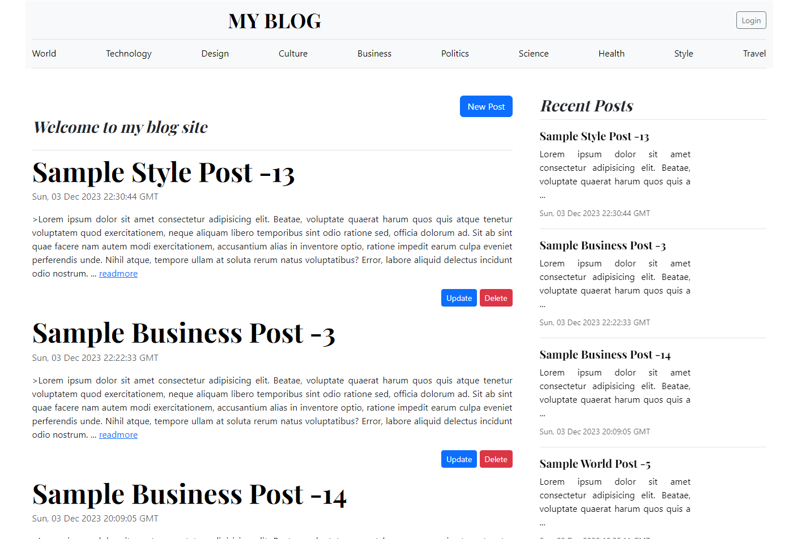

## Express.js MongoDB Blog Site


This is a simple blog site built using Express.js, MongoDB, Mongoose, and EJS. It allows users to create, read, update, and delete blog posts.

## Features

User Authentication: Users can sign up and log in to the blog site. Authentication is handled using sessions.
Create and Edit Posts: Authenticated users can create new blog posts and edit existing ones.
Delete Posts: Users have the ability to delete their own blog posts.
Responsive Design: The site is designed to be responsive, providing a seamless experience across devices.
Prerequisites

#Express.js

- Robust routing
- Focus on high performance
- Super-high test coverage
- HTTP helpers (redirection, caching, etc)
- View system supporting 14+ template engines
- Content negotiation
- Executable for generating applications quickly

## Installation

Before you begin, ensure you have the following installed on your machine:

Node.js
MongoDB
[download and install Node.js](https://nodejs.org/en/download/).
Installation is done using the
[`npm install` command](https://docs.npmjs.com/getting-started/installing-npm-packages-locally):

```console
$ npm install
```

#env file
PORT=8000
MONGODB=mongodb://127.0.0.1:27017/blogAPP
SECRET_KEY=a7db7ashd7ashd7ahsd7ashd7ashd7hasd7g2367f4e219er
PAGE_SIZE=10
NODE_ENV="development"

## Usage

Register for a new account or log in if you already have one.
Create new blog posts or edit existing ones from the dashboard.
Explore the blog and read posts created by other users.
Log out when you're done.

## Docs & Community

- [Website and Documentation](http://expressjs.com/) - [[website repo](https://github.com/expressjs/expressjs.com)]
- [#express](https://web.libera.chat/#express) on [Libera Chat](https://libera.chat) IRC
- [GitHub Organization](https://github.com/expressjs) for Official Middleware & Modules
- Visit the [Wiki](https://github.com/expressjs/express/wiki)
- [Google Group](https://groups.google.com/group/express-js) for discussion
- [Gitter](https://gitter.im/expressjs/express) for support and discussion
